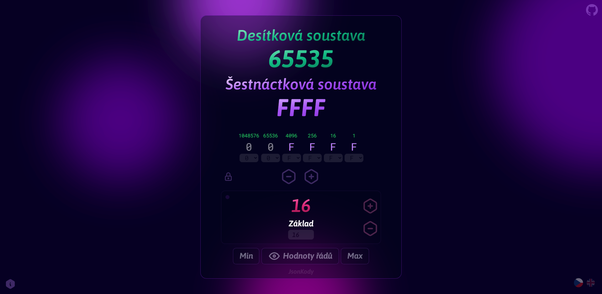

# JK_NAZEV_PROJEKTU 🤌🧐🍷

### [odkaz](http://SEM_NAPIS_URL)



- [Popis](#popis)
- [Instalace](#instalace)
  - [Klonování repozitáře](#klonování-repozitáře)
  - [Instalace závislostí](#instalace-závislostí)
  - [Spuštění aplikace](#spuštění-aplikace)
- [Příspěvky](#příspěvky)
- [Licence](#licence)

## Popis

`JK_NAZEV_PROJEKTU` zde napis dalsi popis projektu ... 


## Instalace

### Klonování repozitáře

**_Pozn.: pořebujete mít nainstalovaný [Git](https://git-scm.com/downloads)_**

```bash
git clone git@github.com:JsonKody/JK_NAZEV_PROJEKTU.git
```

### Instalace závislostí

**_Pozn.: pořebujete mít nainstalovaný [Node.js](https://nodejs.org/en)_**

**Instalace `pnpm` (pokud ho nemáte)**

```bash
npm i -g pnpm
```
**závislosti**
```bash
pnpm i
```

### Spuštění aplikace

```bash
pnpm dev
```

Aplikaci naleznete po úspěšném spuštění na [localhost:4040](http://localhost:4040).


## Příspěvky

Máte-li nějaké nápady na vylepšení nebo chcete opravit bug, neváhejte vytvořit pull request, či založit `issue`.

## Licence
POZOR - pokud tohle pouzivas a nejsi Daniel Cech tak jdi do licence a zmen jmeno na sve. A pripadne zmen rok.

Tento software `Numeral_playground` je poskytován pod MIT licencí, která je dostupná v souboru [LICENSE](LICENSE).
